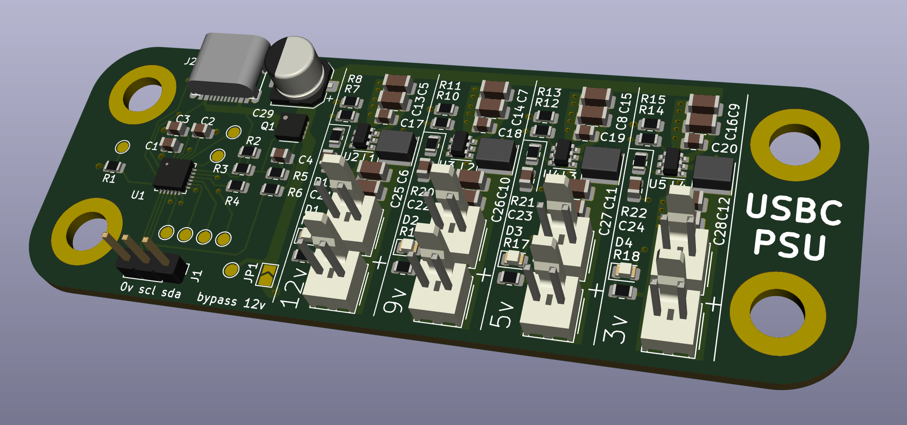
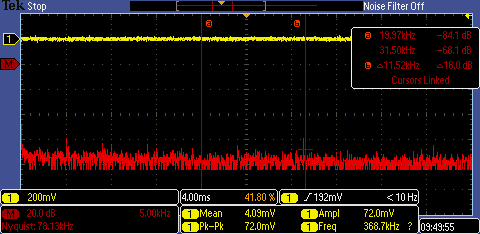

# USBC Synth PSU

* uses STUSB4500 to negotiate 12 or 15v from a USBC power bank
* uses 4 DC/DC switchers to supply 12, 9, 5 and 3v outputs for my various synths

[PDF schematic](schematic.pdf)

# functional todo

* check noise with a 3v generated supply into PO
* looks like aukey charger only goes up to 12v, so add a jumper to short out one of the DC switchers

# schematic todo

* enable switchers only if PD is good?
* check max input dc/dc - 5v! need to find another - how about https://www.ti.com/product/TPS56339#product-details##pps
* calculate all R1 & R2 for dc/dc
* calculate all LED R 
* add more psu outputs (or can remove the 12v one?)
* do we need 5v? (aukey can do 2x usb 5v as well as PD on usbC)
* add part numbers

* mosfet and check pinout - done
* double check pinout and wiring of usb chip - done

# pcb todo

* check gerbers against other designs for pinout
* check space for molex header

* mount holes fit 20mm grid - done

# psu design

## test

FFT of PO-12 with DC/DC 3.3v supply 

# order

* psu power plugs (volca)
* molex 2 pin header and housing, check crimp supply
* how to connect PO
* standoffs

# notes

* proposed USBC charger: https://www.amazon.es/AUKEY-10000-mAh-Delivery-3-0-Cargador-Port%C3%A1til/dp/B07B4RQ47B/ref=sr_1_4?ascsubtag=UUacUdUnU67894YYwYg&dchild=1&keywords=AUKEY+USB+C+Power+Bank+10000mAh%2C+PD+Power+Bank+Slimline+with+18W+PD&linkCode=gs3&qid=1598631552&sr=8-4&tag=androcentr0f-21
* datasheet https://www.st.com/en/interfaces-and-transceivers/stusb4500.html
* sparkfun product https://www.sparkfun.com/products/15801
* tindie product: https://github.com/oxplot/fabpide2
