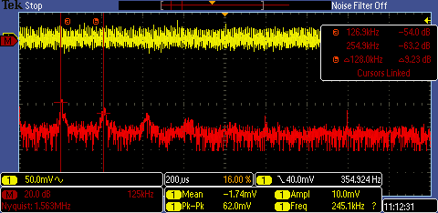
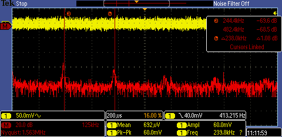
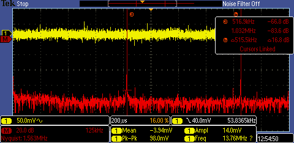
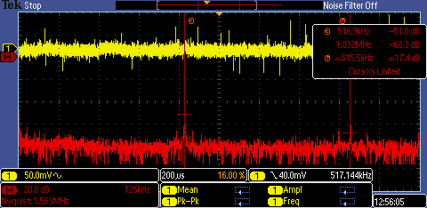

# psu design

## test

To see if powering the audio gear with dc/dc will be a problem, I tried powering a PO-12 with a different dc/dc switcher at 3.3v

## functional todo

* looks like aukey charger only goes up to 12v, so add a jumper to short out one of the DC switchers - done
* check noise with a 3v generated supply into PO - done

## schematic todo

* add part numbers - done
* enable switchers only if PD is good? - no, as PD is open drain and would need an inverter, plus DCDC float to enable
* check max input dc/dc - 5v! need to find another - how about https://www.ti.com/product/TPS56339#product-details##pps - done
* calculate all R1 & R2 for dc/dc - done, used TI webench
* calculate all LED R  - done
* add more psu outputs (or can remove the 12v one?) - done
* do we need 5v? (aukey can do 2x usb 5v as well as PD on usbC) - done anyway
* mosfet and check pinout - done
* double check pinout and wiring of usb chip - done

## pcb todo

* check gerbers against other designs for pinout - done
* check space for molex header - done
* mount holes fit 20mm grid - done

# bring up

* check for shorts between vbus (testpoint) and gnd (corner holes)
* plug in usbC PSU, if the STUSB4500 is working then it will negotiate 5v and turn on the FET
* check the output rail (testpoint) is 5v
* if you have DC/DC switchers with output < 5v they should turn on and LEDs should light
* connect up your I2C controller and follow programming notes below

# programming

The NVM of the STUSB4500 needs to be programmed to sink more than the highest output you want. 
For example 15v (for 12v DC/DC converter).

The Aukey USBC powerbank I bought can only supply up to 12v, so I set the number of PDOs to be 2, and 
ask for 12v. Then I bridge JP1 and don't place any of the DC/DC for the 12v supply.

Here is the [Sparkfun demo firmware I used](../firmware/src/program.ino). To do the programming I used platformio with an Arduino Uno.

Connect the I2C pins and ground to header J1 on the pcb. *SDA and SCL will both need pullups.*

To build and upload, run:

    pio run --target upload

Then open the serial port to see the results.

    pio device monitor -b 115200

# issues

* the Aukey powerbank often gets into a mode where it doesn't do the negotiation (can check the cc lines on scope). In this case output will always be off if setPowerAbove5vOnly() is set.
* the DJI USBC power brick doesn't work at all, and I have no idea how it could as the output is normal USB standard A type.
## 9v switcher waveform results

Results of 9v switcher supplied with 12v from USBC powerbank at 4 different loads.

### 50mA load

### 100mA load

### 500mA load

### 1000mA load

Main spikes look way above audio frequency so hopefully switching noise won't be audible.
For loads <500mA (most likely for my case) AC pk-pk is between 60 and 100mV.

# Noise issues

I experienced some noise issues with the PSU and [documented the investigation here](noise_issue.md)

# Connection issues Wed 16 Sep 10:35:35 CEST 2020

Sometimes the board can't get power from the USBC power supply. This seems intermittent.
The LEDs flash and then go out. I thought it could be to do with lack of charge in the USBC power bank, bad cable,
or the big 100uF cap charging and dropping the voltage low enough for the STUSB4500 to cut off the power.

With the synths, it has stopped being able to power the kaoss pad. As soon as it is plugged in or turned on
the connection is cut.

I checked today with the scope and with enough load the voltage drops and the chip does cut off power (as expected).
The low voltage setting in the firmware was 0.6v, so with a bad cable this could explain it. However it had worked
previously.

I have updated the firmware to allow a 2v voltage drop and have tested up to a 2A load suddenly connecting. At 2A
the voltage drop becomes 2v and the supply is turned off.
