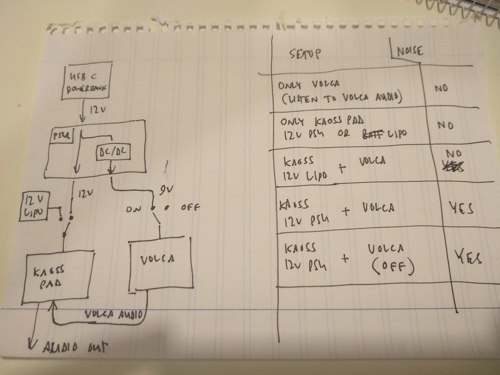
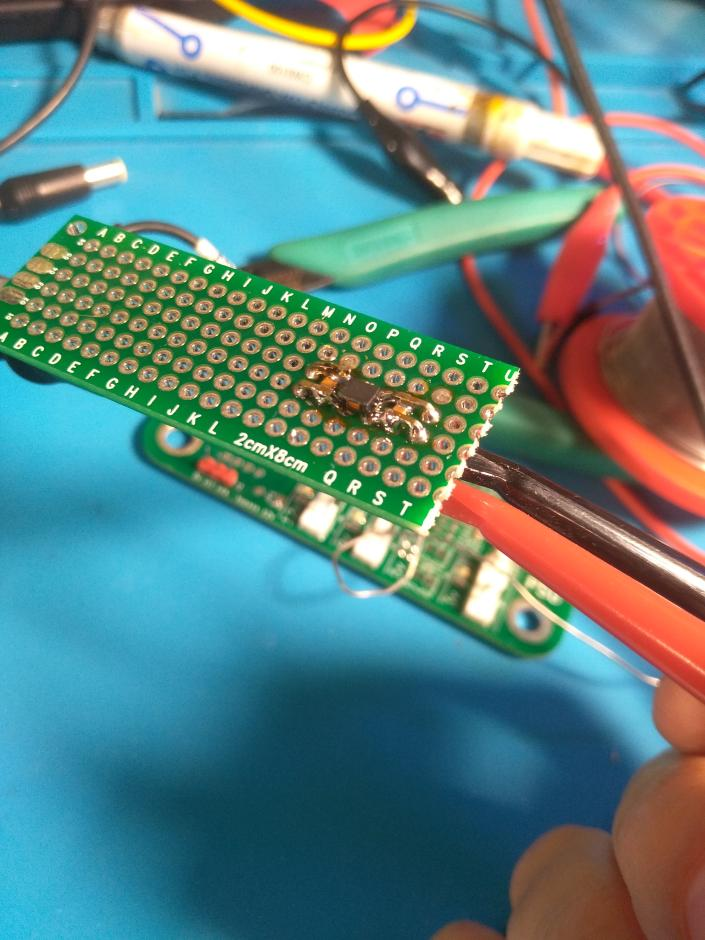
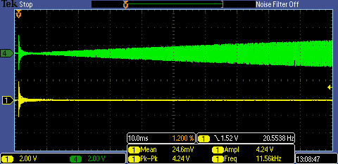

# Noise issue

After plugging the Kaoss pad and volca together I heard a lot of bad noise.

Posted in 1bit squared [electronics discussion channel](https://discord.com/channels/613131135903596547/701517294697840700/755165090306719846) (registration required but info copied here).

Connections and results shown in this image:

Noise recording is [here](noise.wav)

User Obliterous on the discord thought it would be a ground loop related issue and suggested making a common mode choke with a decoupling capacitor on each side.

I made a test board:

And tested it with a 10k -> 10M sweep. 

I will test this in between the Kaoss pad and the PSU.
